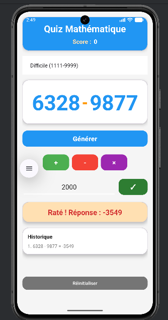

# 📱 MathQuiz Pro

> Une application Android éducative pour s'entraîner au calcul mental de manière ludique et interactive. 

## 🎬 Demo vidéo
[▶️ Voir la démo]([https://your-link-here](https://drive.google.com/file/d/1FBR0o0WmbAH_zU0UddHUW44VR9QBt6am/view?usp=sharing)) : https://drive.google.com/file/d/1FBR0o0WmbAH_zU0UddHUW44VR9QBt6am/view?usp=sharing

## 📝 Description

**MathQuiz Pro** n'est pas une simple calculatrice. C'est un jeu complet conçu pour tester et améliorer vos compétences en mathématiques.

Contrairement aux applications classiques qui donnent la réponse immédiatement, MathQuiz adopte une approche **active** : l'utilisateur doit *deviner* la réponse avant de la valider, ce qui renforce l'apprentissage.

## ✨ Fonctionnalités Clés

### 🎯 Fonctionnalités de Base

* **Génération Aléatoire :** Création infinie d'exercices.
* **Trois Opérations :** Addition (+), Soustraction (−) et Multiplication (×).
* **Interface Intuitive :** Design épuré et facile à utiliser.

### 🚀 Fonctionnalités Avancées (Bonus)

L'application intègre plusieurs fonctionnalités supplémentaires pour enrichir l'expérience utilisateur :

* **🏆 Système de Score Persistant :** Gagnez 10 points par bonne réponse ! Votre score est sauvegardé automatiquement même si vous quittez l'application.
* **🎚️ Niveaux de Difficulté :**
  * *Facile* (11 à 99)
  * *Moyen* (111 à 999)
  * *Difficile* (1111 à 9999)
* **📜 Historique des Réponses :** Gardez une trace de vos 5 derniers calculs pour voir vos erreurs et vos progrès.
* **🎨 Interface Material Design :** Utilisation de composants modernes (CardView, Élévation) et d'animations fluides (rebond, feedback couleur vert/rouge).

## 📸 Captures d'écran

| **Accueil & Configuration** | **Saisie & Réflexion** | **Feedback & Historique** |
|:-----------------------:|:------------------:|:---------------------:|
|  |  |  |

## 🛠️ Architecture Technique

Ce projet respecte les standards de développement Android modernes :

* **Langage :** Java
* **Interface (UI) :** XML (ConstraintLayout, ScrollView)
* **Persistance :** SharedPreferences (pour le score)
* **Architecture :** Séparation stricte Vue (XML) / Contrôleur (Activity)
* **Ressources :** Externalisation complète (`strings.xml`, `colors.xml`, `dimens.xml`) pour une maintenance aisée.

### Logique "Quiz" vs "Calculatrice"

Un soin particulier a été apporté à l'expérience utilisateur (UX) pour éviter l'effet "calculatrice passive" :

1. **Sélection :** L'utilisateur choisit l'opérateur (le symbole `?` se met à jour).
2. **Saisie :** L'utilisateur doit taper son hypothèse.
3. **Validation :** Un bouton spécifique déclenche la vérification et l'animation du résultat (Vert/Rouge).

## 🚀 Installation

1. Clonez ce dépôt :
   ```bash
   git clone [https://github.com/KenzaAEK/Tp1_MathQuiz.git](https://github.com/KenzaAEK/Tp1_MathQuiz.git)
